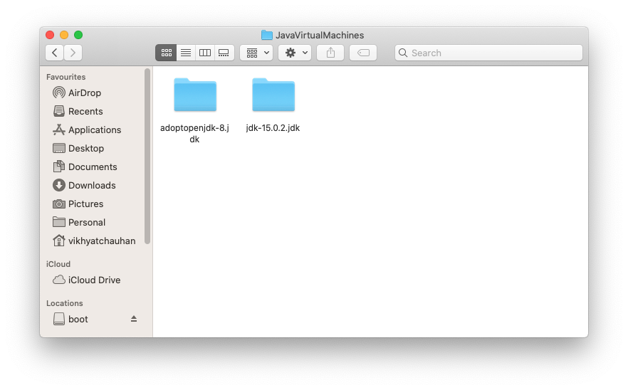

# Confluent-Kafka-Installing-on-MAC
A repo that give with the files and the process of installing Confluent Kafka and Java 8(required by it) on Mac Os Catelina.

## Steps 1 : Install Brew
                /usr/bin/ruby -e "$(curl -fsSL https://raw.githubusercontent.com/Homebrew/install/master/install)"

## Steps 2 : Install Cask or Simple Brew Cask Java8 if already installed.

   Since Java8 is now not directly available and is required to run confluent Flask, the only remaining viable way to install it is via Brew & Cask.
                
                brew install --cask adoptopenjdk/openjdk/adoptopenjdk8
                
## Steps 3 : Find your Java Installation Location
   
   Your previous and currently installed, all Java versions will be stored in this folder. We need to setup the default one to be used in environment variables in    the next step.
   
                /usr/libexec/java_home -V
               
   This will present you with your java Installations and their locations on your device.  For Example :
   
                Last login: Fri Feb 26 11:30:03 on console
                vikhyatchauhan@Vikhyats-MacBook-Pro ~ % /usr/libexec/java_home -V
                Matching Java Virtual Machines (2):
                15.0.2, x86_64:	"Java SE 15.0.2"	/Library/Java/JavaVirtualMachines/jdk-15.0.2.jdk/Contents/Home
                1.8.0_282, x86_64:	"AdoptOpenJDK 8"	/Library/Java/JavaVirtualMachines/adoptopenjdk-8.jdk/Contents/Home

                /Library/Java/JavaVirtualMachines/jdk-15.0.2.jdk/Contents/Home
                vikhyatchauhan@Vikhyats-MacBook-Pro ~ % 

   Here AdoptOpenJDK 8 is the one that we are interested in, am also attaching this Java file so that instead of completing the entire step you can just place        these JDK files into your Java installation folder [/Library/Java/JavaVirtualMachines/].   
   
   

